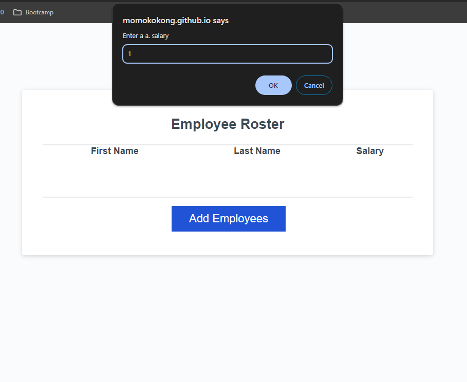
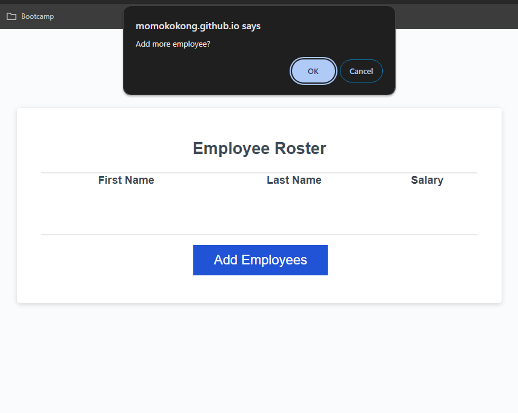
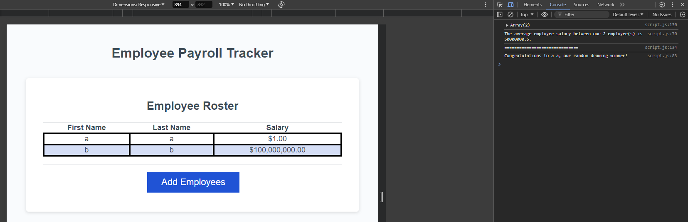

# js-simple-employee-payroll
A very simple employee paroll system done by javascript and does not store any data.

## Project Title: 
Employee Payroll Tracker

## Description:
Once in the page, click "Add Employees". There would be prompts to collect employee info - first anme, last name and salary. After every employee the prompt would ask the user to continue adding or not. If not, the prompt ends and show the entries in the page and in the console there are average salary and a lucky random winner. 

## Installation:
N/A 

## Usage:
open https://momokokong.github.io/js-simple-employee-payroll/ directly from a browser.  Click on the "Add Employees" button to start.  Once done, see the employee info on the page and go to Chrome Dev Tool to see the messages in console.

## Screenshot:
Start:  

Enter employee info:  

Continue or not:  

Show payroll table:  

Messages in console:  

## Contributing:
Let me know if there any tips to improve the page

## License: 
MIT 

## Contact:
[LinkedIn](https://www.linkedin.com/in/poshinhuang/)
